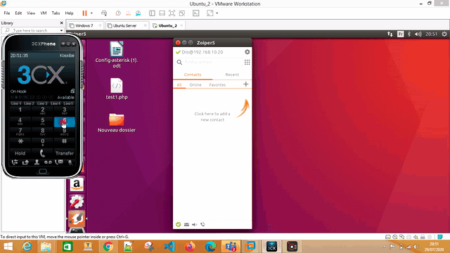
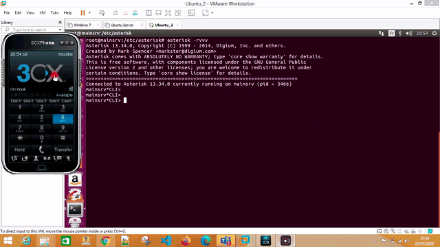

# Asterisk-IVR-VoIP

    This is a simple project  implementing VoIP and an IVR service through ASTERISK IPBX.

## Part I : VoIP 

We perform basic VoIP using 3CX softphones and IVR.

## Part II: IVR service
In this section, a student can receive his exanination results via an IVR.
We chose the A level examination for the purpose of demo.
One can change the database schema and adapt it to its will.
That would also imply an adaptation of the agi script and the asterisk dial plan.

    Kindly refer to the documentation folder for further informations.
    Any trouble or insight? Feel free to open an issue.
